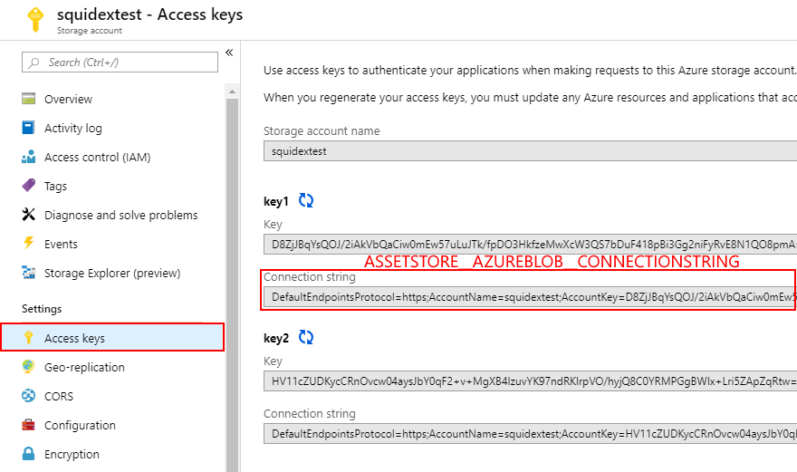
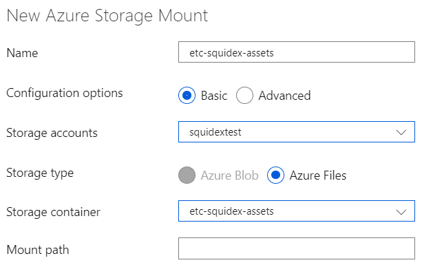
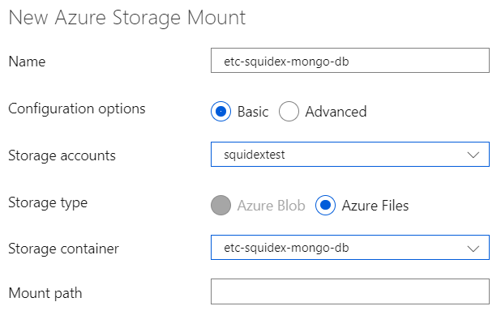

# Install on Azure

Please note that azure also supports Docker compose files so you can also follow the Docker tutorial, especially if it is important for you to be independent from your cloud provider.

In this tutorial I will also not teach you the basics of Azure. it is a very complicated product with thousands of features and you should be familiar with the basics before you follow this tutorial or just learn it on the fly.

## Requirements

Before you start you have to setup a few things first:

1. A resource group for all your squidex resources.
2. A service plan to host squidex (Linux).
3. A storage account for your assets and mongo db (general purpose v1 or v2).

## 1. Create the web app

You can find the docker-compose configurations for Azure here:

> https://github.com/Squidex/squidex-docker/blob/master/standalone

Create a new web app with the following `Basics`:


Configure the `Docker` tab like this:


## 2. Enable logging

In the next step we enable logging. This makes diagnostics easier.

Go to your app service and scroll down to menu item `App Service logs` and turn on file logging. You can then use the `Log stream` to view all log entries.


## 3. Configure your storage account

Go to your storage account instance, choose `Files` and create two file shares.



## 4. Configure your application

Go to the `Configuration section` and choose `Application settings` to configure squidex.

> **IMPORANT**: After you change your configuration values you have to restart your container. In our case the only option was to stop the app service and then start it again. The restart button did not work. Please write a comment if you know a better solution.


Sensitive values are hidden, but configuration values for external authentication providers are empty to turn them off.

## 5. Configure your volumes

Go to the `Configuration section` and choose `Path mappings` to configure volumes.

Click `New Azure Storage Mount` and create the following mapping for your assets store.



Click `New Azure Storage Mount` and create the following mapping for your mongo db store.



## 6. All settings

All basic settings:

```json
[
  {
    "name": "DOCKER_REGISTRY_SERVER_URL",
    "value": "https://index.docker.io",
    "slotSetting": false
  },
  {
    "name": "IDENTITY__ADMINEMAIL",
    "value": "[ADD YOUR VALUE HERE]",
    "slotSetting": false
  },
  {
    "name": "IDENTITY__ADMINPASSWORD",
    "value": "[ADD YOUR VALUE HERE]",
    "slotSetting": false
  },
  {
    "name": "IDENTITY__GITHUBCLIENT",
    "value": "",
    "slotSetting": false
  },
  {
    "name": "IDENTITY__GITHUBSECRET",
    "value": "",
    "slotSetting": false
  },
  {
    "name": "IDENTITY__GOOGLECLIENT",
    "value": "",
    "slotSetting": false
  },
  {
    "name": "IDENTITY__GOOGLESECRET",
    "value": "",
    "slotSetting": false
  },
  {
    "name": "IDENTITY__MICROSOFTCLIENT",
    "value": "",
    "slotSetting": false
  },
  {
    "name": "IDENTITY__MICROSOFTSECRET",
    "value": "",
    "slotSetting": false
  },
  {
    "name": "URLS__BASEURL",
    "value": "[ADD YOUR VALUE HERE]",
    "slotSetting": false
  },
  {
    "name": "URLS__ENFORCEHTTPS",
    "value": "true",
    "slotSetting": false
  },
  {
    "name": "VIRTUAL_HOST",
    "value": "[ADD YOUR VALUE HERE]",
    "slotSetting": false
  },
  {
    "name": "WEBSITES_ENABLE_APP_SERVICE_STORAGE",
    "value": "false",
    "slotSetting": false
  }
]
```

### More issues? 

It is very likely a configuration problem and not related to hosting under azure. Go to the [Configuration](configuration.md) page.
