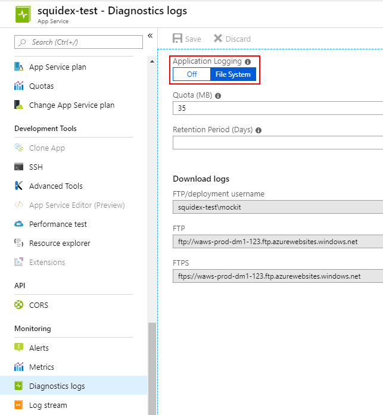
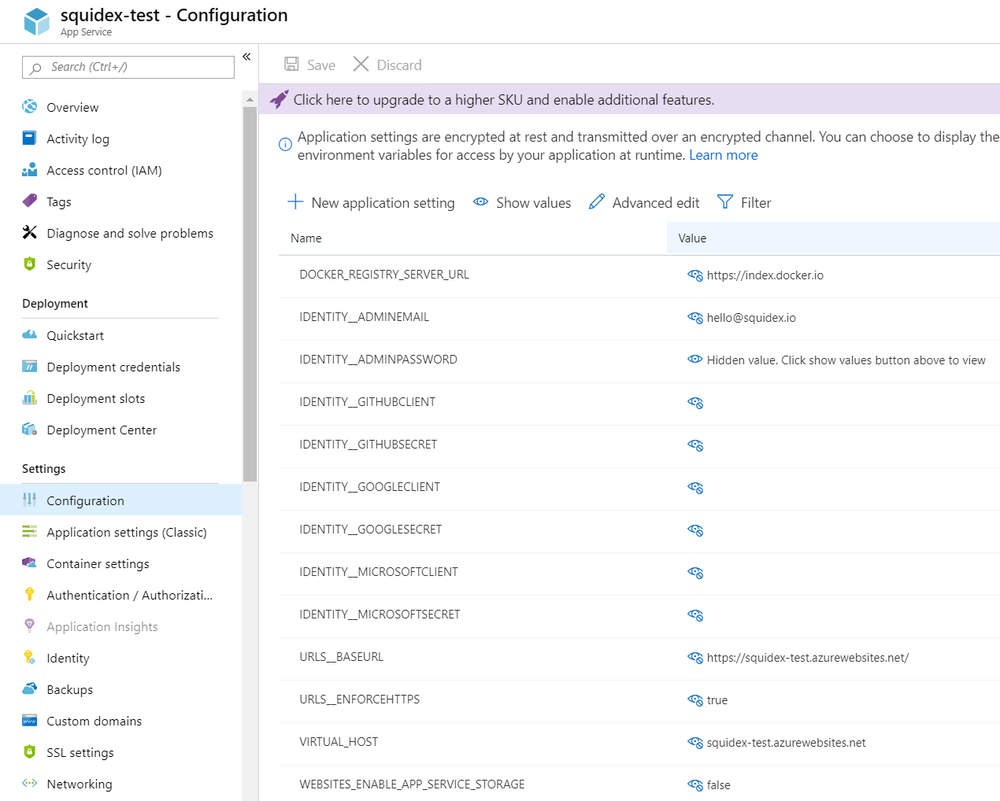

# Install on Azure

Please note that azure also supports Docker compose files so you can also follow the Docker tutorial, especially if it is important for you to be independent from your cloud provider.

In this tutorial I will also not teach you the basics of Azure. it is a very complicated product with thousands of features and you should be familiar with the basics before you follow this tutorial or just learn it on the fly.

## Requirements

Before you start you have to setup a few things first:

1. A resource group for all your squidex resources.
2. A service plan to host squidex.
3. A CosmosDB instance for your database.
4. A storage account for your assets.

## 1. Create the web app

Just create a new web app and follow the settings from the screenshot:

## 2. Enable logging

In the next step we enable logging. This makes diagnostics easier.

Go to y0our app service and scroll down to go to menu item `Diagnostics log` and turn on file logging. You can then use the log stream to view all log entries.

## 3. Configure your application

Go to the `Configuration section` and choose `Application settings` to configure squidex.

Sensitive values are hidden, but configuration values for external authentication providers are empty to turn them off.