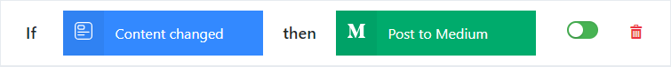

# Rules

A rule is a system to react to events.

## Concept

Whenevery you make a change in Squidex, such as creating content or updating settings, an event is created. An event describes what happened in the past and has a unique name, for example `ContentChanged`.

A rule has two parts:

1. A `trigger` defines when to execute the rule.
2. An `action` defines what to do.

For example



## Workflow

To execute a rule the following steps are excuted:

1. **Enrichment**: The event is enriched with additional information.
2. **Matching**: The matching rules are determined by comparing the trigger with the enriched event.
3. **Formatting**: An rule job is created and stored. A contains all information to execute the rule for the current event.
4. **Execution**: The rule job is queried from the storage and executed. If not succeeded it will be marked for a retry at a later point of time.

### 1. Enrichment

Events contain only the bare minimum as information. For the `ContentPublished` we only need the id of the app and schema and the id of the content. In addition to that we also store metadata, such as the timestamp and the id of the user who created the content. This is common for all events. But for the matching process we need additional information, for example the content itself, so that we can check based on the data of the content item, whether we want to execute the rule.

The enriched events have the following structure:

#### Content Events

```json
{
    "id": "123...", // Id of the content.
    "actor": { "type": "subject", "id": "123..." }, // Id of the user
    "appId": { "name": "my-app", "id": "123..." }, // App name and id
    "created": "2018-01-01T12:00:00Z",
    "createdBy":  { "type": "subject", "id": "123..." },
    "data": { // Content data
        "city": {
            "en": "Munich",
            "de": "München"
        },
        "population": {
            "iv": 123000
        }
    },
    "lastModified": "2018-01-01T12:00:00Z",
    "lastModifiedBy": { "type": "subject", "id": "123..." },
    "schemaId": { "name": "my-schema", "id": "123..." }, // Schema id
    "status": "Draft", // Status of the content: Draft, Archived, Published
    "timestamp": "2018-01-01T12:00:00Z",
    "type": "Created", // The type of the event.
    "user": { // The user information.
        "id": "123...",
        "name": "John Doe",
        "email": "john@email.com"
    },
    "version": 1 // Version of the content, increased with any operation
}
```

#### Asset Events

```json
{
    "id": "123...", // Id of the asset
    "actor": { "type": "subject", "id": "123..." }, // Id of the user
    "appId": { "name": "my-app", "id": "123..." }, // App name and id
    "created": "2018-01-01T12:00:00Z",
    "createdBy": "subject:123",
    "fileName": "Avatar.png",
    "fileSize:": 512000,
    "fileVersion": 1,
    "isImage": true,
    "lastModified": "2018-01-01T12:00:00Z",
    "lastModifiedBy": { "type": "subject", "id": "123..." },
    "mimeType": "image/png",
    "pixelHeight": 600,
    "pixelWidth": 800,
    "timestamp": "2018-01-01T12:00:00Z",
    "type": "Created", // The type of the event.
    "user": { // User information
        "id": "123...",
        "name": "John Doe",
        "email": "john@email.com"
    },
    "version": 1 // Version of the asset, increased with any operation
}
```

It is important to understand the structure because you can reference fields when you define when a rule should be executed. Some actions juse the some structure to pass over the event to other systems: For example, the webhook action adds the event to the request body in (almost) the same format.

### 2. Matching

In the matching process we check whether the action should be executed. There are several conditions:

1. The event type must be correct:
    * A rule with a `AssetChangedTrigger` can only handle asset events.
    * A rule with a `ContentChangedTrigger` can only handle content events.
2. If a condition is defined it must evaluate to true.

A condition is a javascript expression that must return `true` to execute the rule.

Here are some examples to demonstrate it:

Specific asset events:

    event.type == 'Created' || event.type == 'Updated'

Large assets only:

    event.fileSize > 100000000

Images only:

    event.isImage

Of course it can be more complex if necessary.

### 3. Formatting

When you select an action you have to define several settings. In our example above we create a twitter update and have to define the text we want to publish. 

Almost all text settings for actions support placeholder that allow you to use content from the event.

* `$APP_ID`: The id of your app (guid).
* `$APP_NAME`: The name of your app.
* `$USER_ID`: The id of the user (or client).
* `$USER_NAME`: The display name of the user (or client name).
* `$USER_EMAIL`: The email address of the user (or client name).
* `$TIMESTAMP_DATE`: The date when the event has happened (usually different from the time when the rule is executed) in the following format: `yyyy-MM-dd`.
* `$TIMESTAMP_DATETIME`; The date when the event has happened (usually different from the time when the rule is executed) in the following format: `yyyy-MM-dd-hh-mm-ss`.

For content events you can also use:

* `$SCHEMA_ID`: The id of the schema.
* `$SCHEMA_NAME`: The name of the schema.
* `$CONTENT_URL`: The url to the content in the administration tool.
* `$CONTENT_ACTION`: The content action, e.g. *CityContentCreated*.
* `$CONTENT_DATA.city.de`: Reference a data field.

Furthermore you can also use javascript expressions with the following syntax:

    Script(<YOUR_SCRIPT>)

[Javascript template string](https://developer.mozilla.org/de/docs/Web/JavaScript/Reference/template_strings) are very useful here. The placeholders above can be translated to the following expressions:

```js
Script(`${event.appId.id}`)
Script(`${event.appId.Name}`)
Script(`${event.user.id}`)
Script(`${event.user.email}`)
Script(`${formatDate(event.user.timestamp, 'yyyy-MM-dd')}`)
Script(`${formatDate(event.user.timestamp, 'yyyy-MM-dd-hh-mm-ss')}`)

// For content events
Script(`${event.schemaId.id}`)
Script(`${event.schemaId.Name}`)
Script(`${contentUrl()}`)
Script(`${contentAction()}`)
Script(`${event.data.city.de}`)
```

You can also reference any other field from the event and you can if-statements

```js
if (event.fileSize > 100000) {
    return `I just uploaded a large image ${event.fileName}`;
} else {
    return `I just uploaded a small image ${event.fileName}`;
}
```

### 4. Execution

Squidex will make several attempts to execute an job:

1. First attempt, a few seconds after the event has happened.
2. After 5 minutes
3. After 1 hour.
4. After 6 hours.
6. After 12 hours.

Jobs expire after 2 days and will be deleted automatically.

