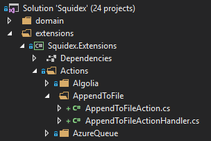
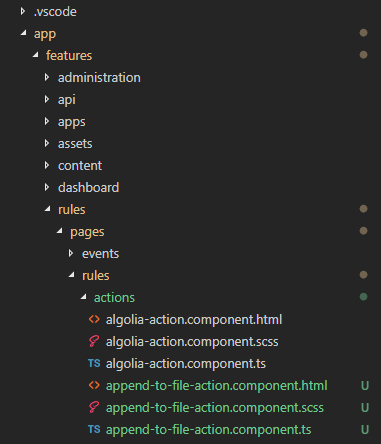

# How to write a custom rule action

This tutorial teaches you how to write a custom rule action.

You have to create several components in C# and angular:

1. [C#] The definition of the rule action.
2. [C#] The action handler to execute the rule action.
3. [Angular] The editor to edit the rule action.

## Our example

In this example we will write an action that adds a new line to a predefined file whenever an event happened. 

We call this action `AppendToFile`.

Typically you want to create an action to communicate with external services, but it shows all essential parts.

## Step1: Backend code

We create two files in the extension project:

1. `AppendToFileAction.cs`: The action definition and dto. This file and class must be named `<ACTION-TYPE>Action`.
2. `AppendToFileActionHandler.cs`: The action handler to execute the rule action.



### Step 1.1: The Action definition

Lets have a look to the file first:

```csharp
//
// AppendToFileAction.cs
//
using System.ComponentModel.DataAnnotations;
using Squidex.Domain.Apps.Core.Rules;

namespace Squidex.Extensions.Actions.WriteToFile
{
    [RuleActionHandler(typeof(AppendToFileActionHandler))] // 1
    [RuleAction( // 2
       IconImage = "<svg xmlns='http://www.w3.org/2000/svg' viewBox='0 0 28 28'></svg>",
       IconColor = "#4bb958",
       Display = "Append to file",
       Description = "Append text to a file",
       ReadMore = "https://en.wikipedia.org/wiki/Log_file")]
    public sealed class AppendToFileAction : RuleAction
    {
        [Required] // 3
        [Display(Name = "Text", Description = "The text to append to the file.")] // 4
        public string Text { get; set; } // 5, 6
    }
}
```

This class has several purposes:

1. It defines the action handler that is used to execute this action.
2. It contains a lot of metadata about the rule action such as:
    * The color of the icon.
    * The svg for the icon.
    * A short description that is used in rule overview (`Display`).
    * A long description that is used when you create a new rule (`Description`).
    * A url to the product or additional information such as documentation.
3. It contains attributes for validation, in this case the text attribute is required.
4. It contains metadata for the properties that are used when the API documentation is generated.
5. It is used to deserialize the json from the API requests.
6. It is used to serialize and deserialize the rule in the database.

Therefore it is important that the rule action is serializable. We also use the widely adopted Newtonsoft.Json library for that: https://www.newtonsoft.com/json.

#### About the Icon:

You have to define the icon as svg content.

* Use https://icomoon.io/ to find a free icon and to export it as svg.
* Use https://jakearchibald.github.io/svgomg/ to minize the svg.

### Step 1.2. The Action handler

The action handler is executed two times:

1. When an event happened, e.g. when a content has been published, the action handler is executed to create a job. The job must contain all information to execute the action at a later point of time. When the action is executed (typically a few ms later for the first time) it has no access to the event anymore. The advantage is that the action can be executed multiple times, e.g. to retry it when an external service is temporarily not available.

2. The scheduler takes the job and calls the action handler again to execute the job.

The following code is a simple implementation for our action:

```csharp
//
// AppendToFileActionHandler.cs
//
using System;
using System.IO;
using System.Threading.Tasks;
using Squidex.Domain.Apps.Core.HandleRules;
using Squidex.Domain.Apps.Core.HandleRules.EnrichedEvents;

namespace Squidex.Extensions.Actions.WriteToFile
{
    public sealed class AppendToFileActionHandler
        : RuleActionHandler<AppendToFileAction, AppendToFileJob>
    {
        public AppendToFileActionHandler(RuleEventFormatter formatter)
            : base(formatter)
        {
        }

        protected override (string Description, AppendToFileJob Data) CreateJob(
            EnrichedEvent @event, AppendToFileAction action)
        {
            // Use event to format the text and allow some placeholder
            // such as content data, user information, timestamps and so on.
            var text = Format(action.Text, @event);

            // Create a description for the logs and the job.
            return ("Append to file.", new AppendToFileJob { Text = text });
        }

        protected override Task<(string Dump, Exception Exception)> ExecuteJobAsync(
            AppendToFileJob job)
        {
            // Do the action.
            File.AppendAllText("PATH-TO-FILE", job.Text);

            // Creates a dump with all ikmportant information for debugging.
            return Task.FromResult(("Appended to file PATH-TO-FILE", (Exception)null));
        }
    }

    public sealed class AppendToFileJob
    {
        public string Text { get; set; }
    }
}
```

## Step 2: Frontend code

The frontend code must be written in Angular, but even if you have no experience with angular you can copy and paste all parts from other actions. You do not have to read the full documentation but it might be helpful to read the guide about forms: https://angular.io/guide/reactive-forms

We have to create an angular component to define the form for our action.



We create three files for the component (typescript), the styles (sass) and the template (html).

### Step 2.1. Create the component

The typescript file contains our component and extends the form with the controls. We have to create one form control for each property in our form action. We also add client-side validation here.

```ts
//
// append-to-file-action.component.ts
//
import { Component, Input, OnInit } from '@angular/core';
import { FormControl, FormGroup, Validators } from '@angular/forms';

@Component({
    selector: 'sqx-append-to-file-action',
    styleUrls: ['./append-to-file-action.component.scss'],
    templateUrl: './append-to-file-action.component.html'
})
export class AppendToFileActionComponent implements OnInit {
    @Input()
    public action: any;

    @Input()
    public actionForm: FormGroup;

    @Input()
    public actionFormSubmitted = false;

    public ngOnInit() {
        this.actionForm.setControl('text',
            new FormControl(this.action.text || '', [
                Validators.required
            ]));
    }
}
```

### Step 2.2: Create the component template

The template is just a bootstrap template that is binded to the form control.

```html
<!-- 
    append-to-file-action.component.html
-->
<form [formGroup]="actionForm" class="form-horizontal">
    <div class="form-group row">
        <label class="col col-3 col-form-label" for="text">Text</label>

        <div class="col col-9">
            <sqx-control-errors for="text" [submitted]="actionFormSubmitted"></sqx-control-errors>

            <textarea class="form-control" id="text" formControlName="text"></textarea>

            <small class="form-text text-muted">
                The text to append to the file. Read the <a routerLink="help">help</a> section for information about advanced formatting.
            </small>
        </div>
    </div>
</form>
```

### Step 2.3: Define the component styles

We just increase the height of `textarea` here. Angular isolates the css for each component, so this css rule is only applied to the textarea of the component.

```css
/* 
    append-to-file-action.component.css
*/
@import '_vars';
@import '_mixins';

textarea {
    height: 150px;
}
```